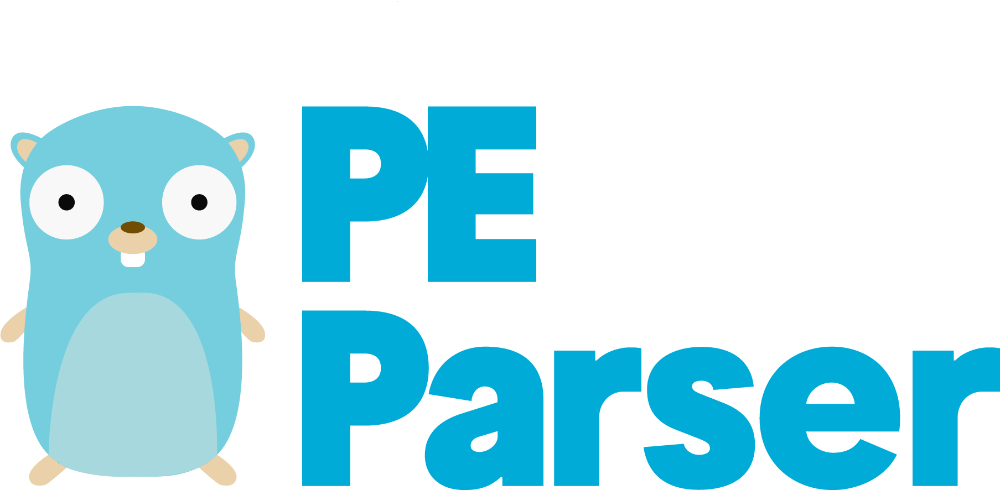

<a href="https://saferwall.com" target="_blank" rel="noopener noreferrer"></a>

# Portable Executable Parser

[](https://pkg.go.dev/github.com/saferwall/pe)  [](https://goreportcard.com/report/github.com/saferwall/pe) [](https://codecov.io/gh/saferwall/pe) 


**pe** is a go package for parsing the [portable executable](https://docs.microsoft.com/en-us/windows/win32/debug/pe-format) file format. This package was designed with malware analysis in mind, and being resistent to PE malformations.

## Table of content

- [Portable Executable Parser](#portable-executable-parser)
  - [Table of content](#table-of-content)
  - [Features](#features)
  - [Installing](#installing)
  - [Using the library](#using-the-library)
    - [PE Header](#pe-header)
    - [Rich Header](#rich-header)
    - [Iterating over sections](#iterating-over-sections)
  - [Roadmap](#roadmap)
  - [Fuzz Testing](#fuzz-testing)
  - [References](#references)

## Features

-   Works with PE32/PE32+ file format.
-   Supports Intel x86/AMD64/ARM7ARM7 Thumb/ARM8-64/IA64/CHPE architectures.
-   MS DOS header.
-   Rich Header (calculate checksum and hash).
-   NT Header (file header + optional header).
-   COFF symbol table and string table.
-   Sections headers + entropy calculation.
-   Data directories
    -   Import Table + ImpHash calculation.
    -   Export Table
    -   Resource Table
    -   Exceptions Table
    -   Security Table + Authentihash calculation.
    -   Relocations Table
    -   Debug Table (CODEVIEW, POGO, VC FEATURE, REPRO, FPO, EXDLL CHARACTERISTICS debug types).
    -   TLS Table
    -   Load Config Directory (SEH, GFID, GIAT, Guard LongJumps, CHPE, Dynamic Value Reloc Table, Enclave Configuration, Volatile Metadata tables).
    -   Bound Import Table
    -   Delay Import Table
    -   COM Table (CLR Metadata Header, Metadata Table Streams)
-   Report several anomalies

## Installing

Using this go package is easy. First, use `go get` to install the latest version of the library. This command will install the `pedumper` executable along with the library and its dependencies:

    go get -u github.com/saferwall/pe

Next, include `pe` package in your application:

```go
import "github.com/saferwall/pe"
```

## Using the library

```go
package main

import (
	peparser "github.com/saferwall/pe"
)

func main() {
    filename := "C:\\Binaries\\notepad.exe"
    pe, err := peparser.New(filename, &peparser.Options{})
	if err != nil {
		log.Fatalf("Error while opening file: %s, reason: %v", filename, err)
    }

    err = pe.Parse()
    if err != nil {
        log.Fatalf("Error while parsing file: %s, reason: %v", filename, err)
    }
}
```

Start by instantiating a pe object by called the `New()` method, which takes the file path to the file to be parsed and some optional options.

Afterwards, a call to the `Parse()` method will give you access to all the different part of the PE format, directly accessible to be used. Here is the definition of the struct:

```go
type File struct {
	DOSHeader    ImageDOSHeader
	RichHeader   RichHeader
	NtHeader     ImageNtHeader
	COFF         COFF
	Sections     []Section
	Imports      []Import
	Export       Export
	Debugs       []DebugEntry
	Relocations  []Relocation
	Resources    ResourceDirectory
	TLS          TLSDirectory
	LoadConfig   LoadConfig
	Exceptions   []Exception
	Certificates Certificate
	DelayImports []DelayImport
	BoundImports []BoundImportDescriptorData
	GlobalPtr    uint32
	CLR          CLRData
	IAT          []IATEntry
	Header       []byte
	data         mmap.MMap
	closer       io.Closer
	Is64         bool
	Is32         bool
	Anomalies    []string
	size         uint32
	f            *os.File
	opts         *Options
}
```

### PE Header

As mentionned before, all members of the struct are directly (no getters) accessible, additionally, the fields types has been preserved as the spec defines them, that means if you need to show the prettified version of an `int` type, you have to call the corresponding helper function.

```go
fmt.Printf("Magic is: 0x%x\n", pe.DosHeader.Magic)
fmt.Printf("Signature is: 0x%x\n", pe.NtHeader.Signature)
fmt.Printf("Machine is: 0x%x, Meaning: %s\n", pe.NtHeader.FileHeader.Machine, pe.PrettyMachineType())
```

Output:
```
Magic is: 0x5a4d
Signature is: 0x4550
Machine is: 0x8664, Meaning: x64
```

### Rich Header

Example:
```go
richHeader, _ := json.Marshal(pe.RichHeader)
fmt.Print(prettyPrint(richHeader))
```

Output:
```json
{
    "XorKey": 2796214951,
    "CompIDs": [
        {
            "MinorCV": 27412,
            "ProdID": 257,
            "Count": 4,
            "Unmasked": 16870164
        },
        {
            "MinorCV": 30729,
            "ProdID": 147,
            "Count": 193,
            "Unmasked": 9664521
        },
        {
            "MinorCV": 0,
            "ProdID": 1,
            "Count": 1325,
            "Unmasked": 65536
        },
        {
            "MinorCV": 27412,
            "ProdID": 260,
            "Count": 9,
            "Unmasked": 17066772
        },
        {
            "MinorCV": 27412,
            "ProdID": 259,
            "Count": 3,
            "Unmasked": 17001236
        },
        {
            "MinorCV": 27412,
            "ProdID": 256,
            "Count": 1,
            "Unmasked": 16804628
        },
        {
            "MinorCV": 27412,
            "ProdID": 269,
            "Count": 209,
            "Unmasked": 17656596
        },
        {
            "MinorCV": 27412,
            "ProdID": 255,
            "Count": 1,
            "Unmasked": 16739092
        },
        {
            "MinorCV": 27412,
            "ProdID": 258,
            "Count": 1,
            "Unmasked": 16935700
        }
    ],
    "DansOffset": 128,
    "Raw": "47vE9afaqqan2qqmp9qqprOxq6ej2qqmrqI5pmbaqqan2qumit+qprOxrqeu2qqms7Gpp6TaqqazsaqnptqqprOxp6d22qqms7FVpqbaqqazsainptqqplJpY2in2qqm"
}

```

### Iterating over sections

```go
for _, sec := range pe.Sections {
    fmt.Printf("Section Name : %s\n", sec.NameString())
    fmt.Printf("Section VirtualSize : %x\n", sec.Header.VirtualSize)
    fmt.Printf("Section Flags : %x, Meaning: %v\n\n",
        sec.Header.Characteristics, sec.PrettySectionFlags())
}
```

Output:

```
Section Name : .text
Section VirtualSize : 2ea58
Section Flags : 60500060, Meaning: [Align8Bytes Readable Align16Bytes Executable Contains Code Initialized Data Align1Bytes]

Section Name : .data
Section VirtualSize : 58
Section Flags : c0500040, Meaning: [Readable Initialized Data Writable Align1Bytes Align16Bytes Align8Bytes]

Section Name : .rdata
Section VirtualSize : 18d0
Section Flags : 40600040, Meaning: [Align2Bytes Align8Bytes Readable Initialized Data Align32Bytes]

...
```

## Roadmap

- imports MS-styled names demangling
- PE: VB5 and VB6 typical structures: project info, DLLCall-imports, referenced modules, object table

## Fuzz Testing

To validate the parser we use the [go-fuzz](https://github.com/dvyukov/go-fuzz) and a corpus of known malformed and tricky PE files from [corkami](https://github.com/corkami/pocs/tree/master/PE).

## Projects Using This Library

  <a href="https://www.fibratus.io" >
    
  </a>

[Fibratus](https://github.com/rabbitstack/fibratus) A modern tool for Windows kernel exploration and tracing with a focus on security.

## References

- [Peering Inside the PE: A Tour of the Win32 Portable Executable File Format by Matt Pietrek](http://bytepointer.com/resources/pietrek_peering_inside_pe.htm)
- [An In-Depth Look into the Win32 Portable Executable File Format - Part 1 by Matt Pietrek](http://www.delphibasics.info/home/delphibasicsarticles/anin-depthlookintothewin32portableexecutablefileformat-part1)
- [An In-Depth Look into the Win32 Portable Executable File Format - Part 2 by Matt Pietrek](http://www.delphibasics.info/home/delphibasicsarticles/anin-depthlookintothewin32portableexecutablefileformat-part2)
- [Portable Executable File Format](https://blog.kowalczyk.info/articles/pefileformat.html)
- [PE Format MSDN spec](https://docs.microsoft.com/en-us/windows/win32/debug/pe-format)
- [DotNET format](https://www.ntcore.com/files/dotnetformat.htm)
- [BlackHat 2011 - CONSTANT INSECURITY: (PECOFF) Portable Executable FIle Format](https://www.youtube.com/watch?v=uoQL3CE24ls)
